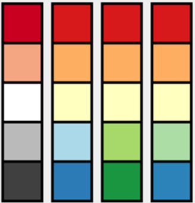

# Colorbrewer 
[](https://travis-ci.org/rcsb/colorbrewer)  [](https://github.com/rcsb/colorbrewer) [](https://github.com/rcsb/colorbrewer/blob/master/LICENSE)


> Create color blind friendly color palettes in Java.

> [!NOTE]
> Note that this repository has been archived because it is not actively maintained anymore.

The color palettes provided by this library are based on the colors provided by the [color brewer project](http://colorbrewer.org/),

In principle there are three types of palettes provided:

* Sequential


* Diverging


* Qualitative


For each palette any number of steps (=colors) in the palette can be requested.


## How to Use

### Show a user Dialog

```java
	final ColorPaletteChooserDialog dialog = new ColorPaletteChooserDialog();
	dialog.show();
	if(dialog.wasOKPressed()) {
		Color c = dialog.getColor();
	}
```

will display this dialog:


### Create a palette programmatically

Get a color palette with a specific number of color:

```java
	boolean colorBlindSave = true;
		ColorBrewer[] sequentialPalettes = ColorBrewer.getSequentialColorPalettes(colorBlindSave);	


		ColorBrewer myBrewer = sequentialPalettes[0];

		System.out.println( "Name of this color brewer: " + myBrewer);

		// I want a gradient of 8 colors:
		Color[] myGradient = myBrewer.getColorPalette(8);

		// These are the color codes:
		for (Color color: myGradient){
			// convert to hex for web display:
			String hex = Integer.toHexString(color.getRGB() & 0xffffff);			
			System.out.println("#"+hex+";");
		}
		
		return myGradient;
	
	
```

This provides the following 8 blue colors:


## Installation

This project is now hosted on Maven Central. You can install the jar file by adding this to your project configuration:

``` 
<dependencies>
 <dependency>
  <groupId>org.biojava</groupId>
  <artifactId>jcolorbrewer</artifactId>
  <version>5.2</version>
 </dependency>
</dependencies>
```

## Example Application

Here we are coloring the various components of the virus structure of the human poliovirus ( PDB ID [3J69](http://www.rcsb.org/pdb/explore/explore.do?structureId=3J69) ) .


## Acknowledgments
Colors from [www.ColorBrewer.org](http://www.colorbrewer.org) by Cynthia A. Brewer, Geography, Pennsylvania State University.

